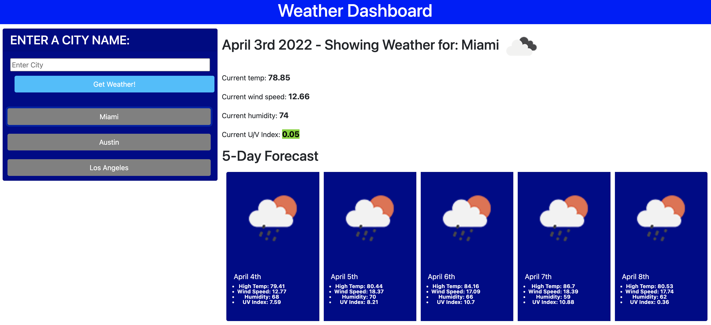

# Colin's Weather Dashboard

## Description

This program allows the user to enter a city and have its current weather and 5 day forecast weather shown.  The application will show the current temp, wind speed, humidity and UV index.  The program will color code the UV index so the user can visually see if the index is low, moderate, high and very high.  The program will also save historical city searches so the user can quickly load previous cities weather.

## Technologies Used

openweathermap.org open API, Bootstrap, HTML, CSS, javascript, git, moment.js and jquery

## Usage

All the user needs to do is input a city in the search box and the program will return weather results.

## User Story

* AS A traveler
I WANT to see the weather outlook for multiple cities
SO THAT I can plan a trip accordingly

## Acceptance Criteria

* GIVEN a weather dashboard with form inputs
* WHEN I search for a city
* THEN I am presented with current and future conditions for that city and that city is added to the search history
* WHEN I view current weather conditions for that city
* THEN I am presented with the city name, the date, an icon representation of weather conditions, the temperature, the humidity, the wind speed, and the UV index
* WHEN I view the UV index
* THEN I am presented with a color that indicates whether the conditions are favorable, moderate, or severe
* WHEN I view future weather conditions for that city
* THEN I am presented with a 5-day forecast that displays the date, an icon representation of weather conditions, the temperature, the wind speed, and the humidity
* WHEN I click on a city in the search history
* THEN I am again presented with current and future conditions for that city

## Screenshot

## Credits

* W3 schools tutorials, stackoverflow, openweathermap.org and my tutor Alexis and github for help and reference.
* Built by Colin McElhatton
* Contact: colin@colinworks.com

## Link to deployed page

[Colin Code Quiz Link - Click here!](https://mcelhatton.github.io/weather-dashboard/)